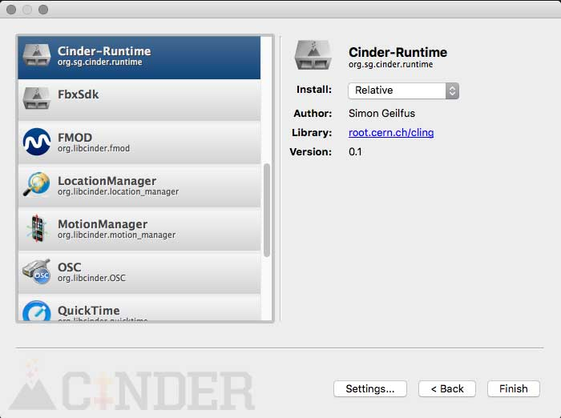
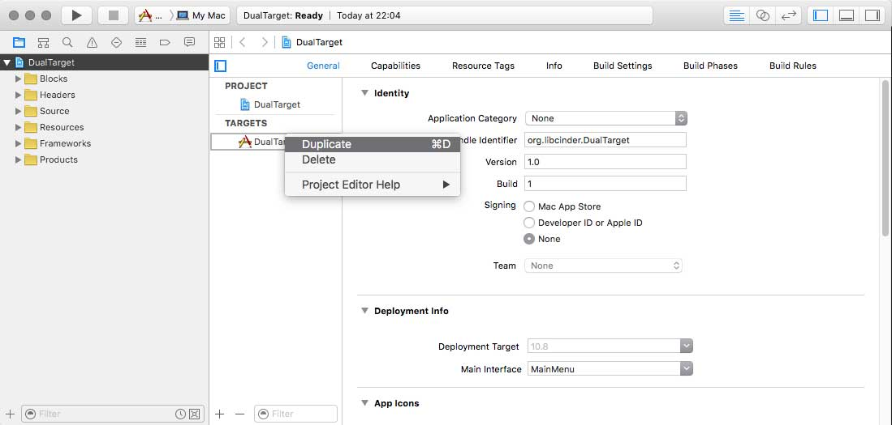
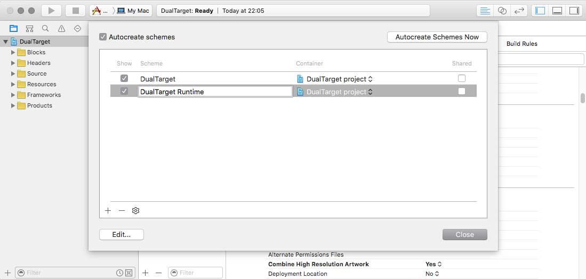
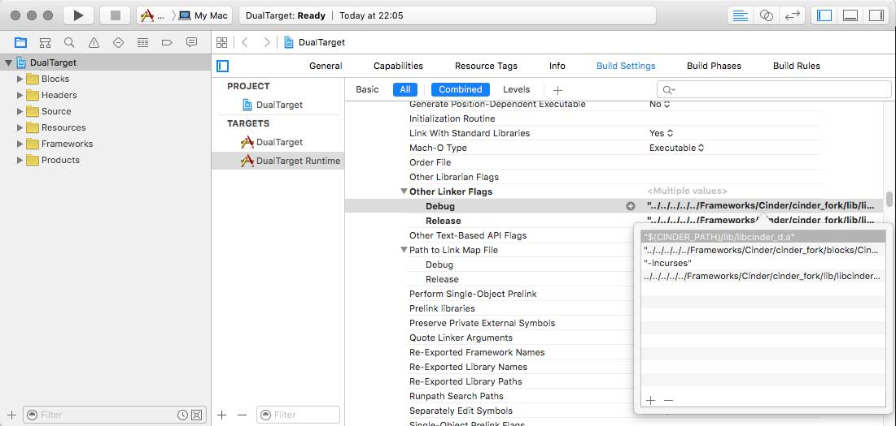
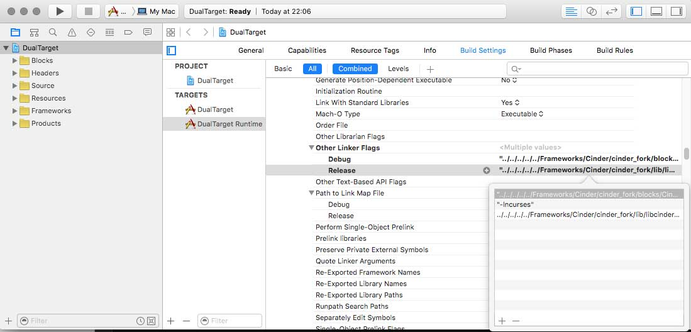
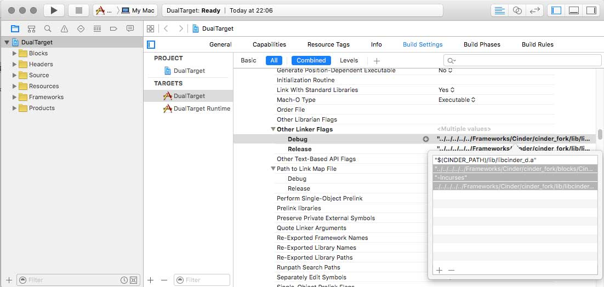
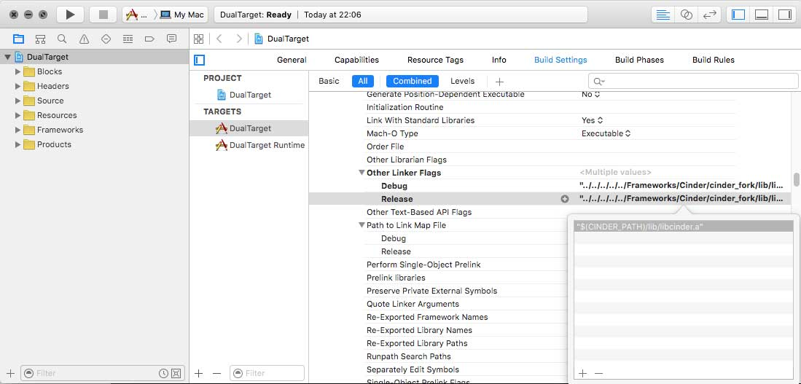
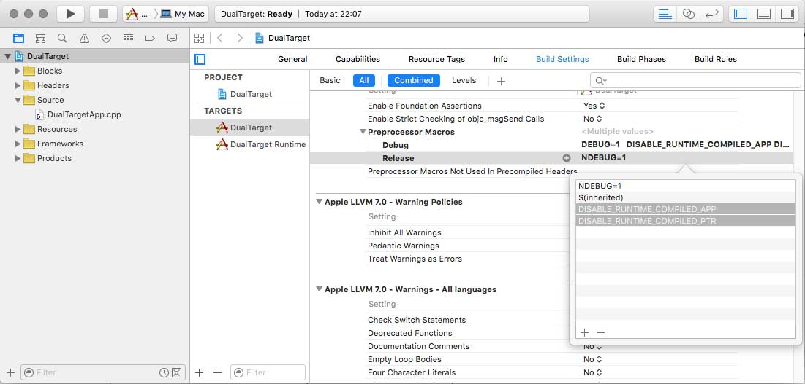
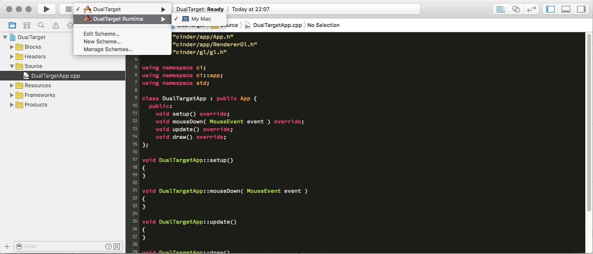

Cinder-Runtime
===================

**! Requires [Watchdog](https://github.com/simongeilfus/Watchdog) cinderblock !**   

####Introduction

This block explores what is currently possible to do using Cling, Llvm and Clang. **Think of this as a proof-of-concept and a first pass at understanding how to use clang directly.** Ideally Cling will be removed at some point for a better solution but the block is already usable in its current form.

The block consists of two main files. The first file contains the ```runtime_ptr``` template. This class wraps a ```shared_ptr``` and pretty much works the same way at the exception that the wrapped class will be reloaded at runtime each time the source file is saved. This can be used to prototype code without having to wait between each compilation. It comes with its own limitations and is certainly not as complete as similar projects but clearly less invasive and much easier to use.  
  
The second part of this block is the ```CINDER_RUNTIME_APP``` macro that replaces the usual ```CINDER_APP``` and have your whole app being re-compiled at runtime. 

*Make sure to read the ["How it works"](#how-it-works) section to understand what you can and can't do.*


The block only supports [OSX](#osx-build-instructions) at the moment but PRs for windows are definitly most welcome. I've not managed to build clang and llvm properly on windows yet and would love if someone could give a hand on that part!


####```runtime_ptr```

###### Setup, Options, libraries and include paths

Include the class you want to update at runtime and the runtime_ptr header:
```c++
#include "MyClass.h"
#include "runtime_ptr.h"
```
Declare your instance the same way you would with a std::shared_ptr:
```c++
runtime_ptr<MyClass> mPtr;
```

By default the library will try to automatically locate the source file of your class. If your class is in a file with a different name or if you want to specify a filename manually, use ```runtime_class<T>::initialize```. If the library fail to locate the source files and if you don't register the class manually you'll get a MissingInterpreterException :

Here's how to do it manually:

```c++
#ifndef DISABLE_RUNTIME_COMPILED_PTR
runtime_class<MyClass>::initialize( "MyClass.cpp" )
#endif
```
You can pass Options to the initialize method if your class needs to access anything else
```c++
runtime_class<MyClass>::initialize( "MyClass.cpp", runtime_class<MyClass>::Options().cinder() );
runtime_class<MyClassOtherClass>::initialize( "MyClassOtherClass.cpp", runtime_class<MyClassOtherClass>::Options()
		.cinder()
		.includePath( "../../../blocks/ImGui/include" )
		.includePath( "../../../blocks/ImGui/lib/imgui" )
		.dynamicLibrary( "../../../blocks/ImGui/lib/libCinderImGui.dylib" ) );
```

Once the class is registered, you can create new instances with ```make_runtime<T>()```. From there the ```runtime_ptr``` will be updated with the new implementation each time you save "MyClass.cpp".
```c++
mPtr = make_runtime<MyClass>();
```

As the pointer could become invalid you might want to wrap any call in a if:
```c++
if( mPtr ) {
  mPtr->doSomething();
}
```

###### Virtual methods

Any method that is used outside of the class files at compile time and that you want to be able to modify at runtime **needs** to be virtual for the whole hack to work. That also means that you can't change this function signature between two compilation.
```c++
class MyClass {
  virtual void doSomething();
  void doSomethingElse(); // changes to that method at runtime will only work inside the class
};
```

###### Disable runtime_ptr

You can easily disable the whole library by using ```DISABLE_RUNTIME_COMPILED_PTR```. As soon as you define ```DISABLE_RUNTIME_COMPILED_PTR``` all the runtime_ptr instances will be replaced by ```std::shared_ptrs``` and all call to ```make_runtime<MyClass>()``` will be transformed to ```std::make_shared<MyClass>()```.


###### Cereal Support

If you want the state of your class to be saved between implementation updates you can define ```RUNTIME_PTR_CEREALIZATION``` before importing runtime_ptr header:
```c++
#define RUNTIME_PTR_CEREALIZATION
#include "runtime_ptr.h"
```

If the save and load functions are detected as member of your class at compile time, they will be used to store the state of each instance. Unfortunately you can't use the templated version of Cereal as the methods need to be virtual for it to work:
```c++
#include <cereal/archives/binary.hpp>

class Object {
public:
	virtual void save( cereal::BinaryOutputArchive &ar );
	virtual void load( cereal::BinaryInputArchive &ar );
	
protected:
	float mValue0, mValue1, mValue2;
};
void Object::save( cereal::BinaryOutputArchive &ar )
{
	ar( mValue0, mValue1, mValue2 );
}
void Object::load( cereal::BinaryInputArchive &ar )
{
	ar( mValue0, mValue1, mValue2 );
}
````

####```CINDER_RUNTIME_APP```
A ```runtime_app``` works pretty much the same as a ```runtime_ptr```; just include the ```runtime_app.h``` header, replace the usual ```CINDER_APP``` by ```CINDER_RUNTIME_APP``` and you should be good to go. The same downsides apply so make sure to read the rest.
```c++
#include "cinder/app/App.h"
#include "cinder/app/RendererGl.h"
#include "cinder/gl/gl.h"

// uncomment this to disable runtime compilation
// #define DISABLE_RUNTIME_COMPILED_APP
#include "runtime_app.h"

using namespace ci;
using namespace ci::app;
using namespace std;

class RuntimeApp : public App {
  public:
	void setup() override;
	void update() override;
	void draw() override;
};

void RuntimeApp::setup() {}
void RuntimeApp::update() {}
void RuntimeApp::draw() { gl::clear( Color( 0, 0, 0 ) ); }

// this is the only thing to change to your app
CINDER_RUNTIME_APP( RuntimeApp, RendererGl )
```

####How it works

To allow to use the fast REPL of Cling, no symbols are unloaded in the interpreter and the code doesn't touch the main app symbols. Instead ```runtime_ptr``` uses a pretty ugly hack based around polymorphism. The ```shared_ptr``` itself will be of the type of the class compiled when building the app, but the actual content will be of a temporary type inheriting from your class. As the REPL system of Cling is made to append code to existing code instead of reloading it, what ```runtime_ptr``` does behind the scene would more or less look like this :

```c++
namespace RuntimeBase { class Object {}; }
std::shared_ptr<RuntimeBase::Object> instance = std::make_shared<RuntimeBase::Object>();
// file saved
namespace Runtime_Object_cling_Un1Qu34 { class Object : public RuntimeBase::Object {}; }
instance = std::make_shared<Runtime_Object_cling_Un1Qu34::Object>();
// file saved
namespace Runtime_Object_cling_Un1Qu35 { class Object : public RuntimeBase::Object {}; }
instance = std::make_shared<Runtime_Object_cling_Un1Qu35::Object>();
// file saved
namespace Runtime_Object_cling_Un1Qu36 { class Object : public RuntimeBase::Object {}; }
instance = std::make_shared<Runtime_Object_cling_Un1Qu36::Object>();
// file saved
namespace Runtime_Object_cling_Un1Qu37 { class Object : public RuntimeBase::Object {}; }
instance = std::make_shared<Runtime_Object_cling_Un1Qu37::Object>();
```

Kind of ugly but it does allow fast reloading of your class while keeping an extremly simple API. Unfortunately it obviously comes with a few downsides explained above.

####OSX Build Instructions

###### Cloning the repository
Clone both this repository and watchdog repository into Cinder's blocks folder:
```shell
cd cinder/blocks
git clone https://github.com/simongeilfus/Watchdog.git
git clone https://github.com/simongeilfus/Cinder-Runtime.git
```

###### Install Libraries
Then run the ```install.sh``` script to grab and build Cling, Llvm and Clang. This will generate the necessary include and library files in the lib folder.
```shell
cd cinder-runtime
#you might want to try a xcode-select --install before starting
#the install script, just to be sure you have everything installed
sh install.sh
```

###### Build Cinder as a dynamic library
- Right click cinder target / duplicate
- Rename the new target to "cinder_dynamic"
- Then change the following settings:
- Linking / MACH_O_TYPE = mh_dylib / Dynamic Library
- Linking / LINK_WITH_STANDARD_LIBRARIES = YES
- Packaging / EXECUTABLE_EXTENSION = dylib
- Build Phases / Add IOKit, IOSurface, Accelerate, CoreAudio, CoreMedia and AVFoundation frameworks
- Rename Product Name to "cinder" and "cinder_d"
- Build ```libcinder.dylib``` and ```libcinder_d.dylib```

Or see PR/Discussion [here](https://github.com/cinder/Cinder/pull/1355).

###### Potential errors about ```unistd.h``` or ```XcodeDefault.xctoolchain```
If you run into that kind of errors you might want to try to update your command line dev. tools by running a ```xcode-select -—install``` in terminal. If that doesn't work, try to update xcode. Once you have that solved you can remove the folders created by the install script and restart it.


####OSX New Project Guide
**The block works only in "relative mode" so don't try to copy it!**

When creating a new project, you should go to your build settings and remove "libcinder.a"/"libcinder_d.a" from your "Other Linker Flags".

Tinderbox should create everything for you but here's a few extra steps to setup things in a nice and unobtrusive way.

- Start Tinderbox, name your project and add "Cinder-Runtime" as a relative block :  
  
  

- Open the xcode project and duplicate the main target :  
  
  
  
- Rename both the new target and the new scheme :  
  
  
  
- Go in the "Runtime target" and remove cinder's static library from the linkers settings (do that for both release and debug mode) :  
  

  
  
- Go to the same place in the main target and do the opposite, remove all 3 flags related to Cinder-Runtime and Cling:  
  
  

- The main target linker settings should now look as usual without any trace of this block :  
  
  
  
- Scroll down to the Preprocessors Macros and add ```DISABLE_RUNTIME_COMPILED_APP``` and ```DISABLE_RUNTIME_COMPILED_PTR``` macros:  
  
  
  
- You can now switch between a live-compiled and a perfectly clean version of your app. No need to add anything else to the code, the different preprocessors will take care of removing anything related to Cinder-Runtime. This [sample](samples/DualTarget) is setup following this guide.  
  
  
  